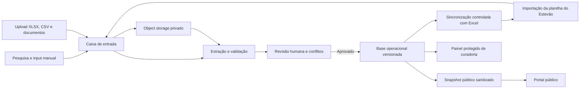
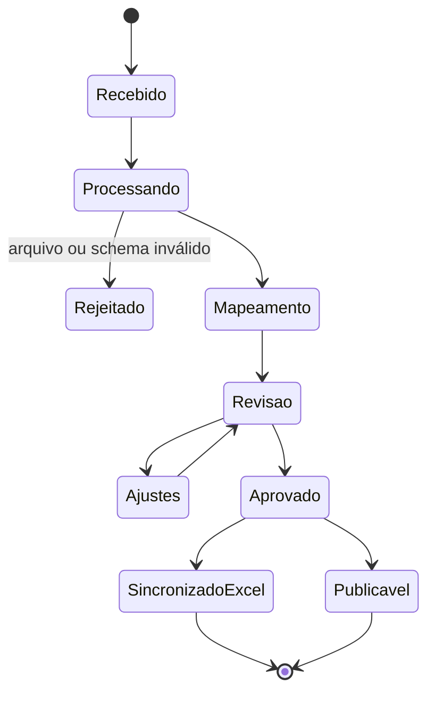

# Arquitetura do SECC App

Status: arquitetura revisada para dados, uploads e sincronização com Excel.  
Data: 15/07/2026.

## 1. Princípio central

O Excel continuará sendo o livro oficial de acompanhamento do Estevão. O aplicativo será o ambiente
operacional de entrada, curadoria, aprovação e publicação. Para evitar dois mestres concorrentes,
cada camada terá uma responsabilidade explícita.

| Camada | Responsabilidade |
|---|---|
| Evidências | Documentos, links e arquivos originais imutáveis |
| Base operacional | Dados estruturados, versões, status, autoria e auditoria |
| Planilha mestre | Acompanhamento executivo e canal de intercâmbio com o Estevão |
| Dataset público | Fotografia sanitizada dos registros aprovados |

## 2. Visão geral



## 3. Componentes

### Aplicação

- Next.js com App Router e TypeScript estrito.
- Portal público para consulta.
- Área protegida para curadores, revisores e administradores.
- APIs e ações de servidor para gravações; nenhum segredo ou permissão sensível no navegador.

### Banco operacional

Banco relacional compatível com PostgreSQL para:

- empresas, períodos e variáveis;
- valores e estados de ausência;
- fontes e evidências;
- lotes de importação;
- revisões e aprovações;
- conflitos;
- execuções de sincronização;
- usuários, papéis e trilha de auditoria.

No Vercel, a seleção do provedor deve ocorrer na implementação entre integrações PostgreSQL do
Marketplace. Não acoplar o domínio a um fornecedor específico.

### Armazenamento de arquivos

Object storage privado para planilhas, CSVs, PDFs e demais evidências enviadas. O banco armazena
metadados, hash, usuário, status de processamento e vínculo com os dados extraídos.

Vercel Blob ou armazenamento compatível pode ser selecionado na implementação. Arquivo enviado não
é publicado automaticamente.

### Processamento

- Arquivos pequenos e simples podem ser validados durante a requisição.
- PDFs, planilhas extensas e extrações demoradas devem usar processamento assíncrono.
- Todo job deve ser idempotente e registrar tentativas, erros e resultado.
- A adoção de fila gerenciada deve ser feita quando o fluxo assíncrono entrar no escopo do MVP.

## 4. Sincronização com Excel

### Modo A — Microsoft Graph

Preferencial quando a planilha estiver em OneDrive for Business ou SharePoint.

- Ler e gravar tabelas e intervalos por sessão persistente.
- Manter identificador do arquivo e versão/ETag.
- Bloquear a sincronização se a planilha tiver mudado desde a última leitura.
- Aplicar um lote por vez.
- Criar backup ou versão antes da gravação.
- Registrar células afetadas, usuário, horário e resultado.

A API do Excel no Microsoft Graph oferece leitura e escrita de workbooks armazenados nas plataformas
corporativas suportadas. A viabilidade depende da conta e das permissões do arquivo.

### Modo B — Intercâmbio de arquivo

Fallback quando a planilha estiver em OneDrive pessoal ou quando a integração corporativa não for
autorizada.

1. Estevão envia ou seleciona a versão atual da planilha.
2. O app valida estrutura e versão.
3. O app compara Excel e base operacional.
4. Um revisor resolve conflitos.
5. O app gera uma nova planilha completa, preservando abas, fórmulas e formatação.
6. A nova versão é disponibilizada para substituição controlada no OneDrive.

### Regras comuns

- Nunca gravar célula diretamente a partir de um formulário.
- Formulário cria proposta; aprovação cria revisão; sincronização aplica lote aprovado.
- Chave de idempotência impede reaplicação do mesmo lote.
- O Excel deve conter uma aba técnica ou metadados com `workbookVersion`, `dataVersion`, data da
  última sincronização e identificador do lote.
- Alterações manuais do Estevão entram como propostas de mudança, não como overwrite silencioso.

## 5. Fluxo de entrada de dados



Entradas previstas:

- formulário de pesquisa com fonte e observação;
- inclusão ou edição manual de um dado;
- importação em lote por XLSX ou CSV;
- upload de demonstrativo ou documento de suporte;
- importação de mudanças da planilha mestre;
- conectores futuros para CVM, BCB e outras fontes autorizadas.

## 6. Papéis e autorização

| Papel | Permissões principais |
|---|---|
| Público | Consultar apenas dados publicados |
| Curador | Pesquisar, inserir propostas e enviar arquivos |
| Revisor | Comparar, corrigir, aprovar ou rejeitar |
| Administrador | Gerenciar usuários, schemas, sincronização e publicação |

O provedor de autenticação será decidido na implementação. Toda autorização deve ser aplicada no
servidor e toda alteração deve ter autor identificado.

## 7. Rotas

### Públicas

| Rota | Função |
|---|---|
| `/` | Visão executiva do projeto |
| `/empresas` | Lista, pesquisa e filtros |
| `/empresas/[slug]` | Empresa 360, histórico e fontes |
| `/comparador` | Comparação de trajetórias |
| `/metodologia` | Definições, critérios e limitações |
| `/dados` | Cobertura, versão, fontes e download público |
| `/sobre` | Projeto, autoria e avisos |

### Protegidas

| Rota | Função |
|---|---|
| `/admin` | Situação da coleta e pendências |
| `/admin/entrada` | Pesquisa e input manual |
| `/admin/importacoes` | Uploads e lotes |
| `/admin/revisao` | Fila de revisão e aprovação |
| `/admin/conflitos` | Divergências entre app, fontes e Excel |
| `/admin/excel` | Status e execução da sincronização |
| `/admin/auditoria` | Histórico de alterações |

## 8. Organização do código

```text
src/
|-- app/             rotas públicas, protegidas e APIs
|-- components/      UI, gráficos e layout
|-- features/        módulos de produto
|-- lib/             banco, storage, parsers, Excel, auth e validação
|-- styles/          tokens e estilos globais
`-- types/           domínio e contratos

db/                  schema e migrações
workers/             processamento assíncrono
data/schemas/        schemas de importação e publicação
```

## 9. Publicação

- O GitHub contém código, migrações, schemas e dados públicos aprovados.
- Arquivos enviados permanecem em storage privado.
- A área pública pode usar cache e snapshots para desempenho.
- A área protegida consulta a base operacional atual.
- Deploy no Vercel não deve depender da presença local da planilha.

## 10. Decisões pendentes para a implementação

1. **Resolvido:** arquivo oficial em OneDrive pessoal; usar intercâmbio de XLSX versionado.
2. **Resolvido para a etapa local:** provisionar somente um administrador.
3. **Resolvido para a etapa local:** PostgreSQL e storage em filesystem locais, sem provedor externo.
4. Definir tipos e tamanhos máximos de upload para produção.
5. Definir se a próxima entrega inclui processamento automático de PDFs ou apenas armazenamento e
   input assistido.

A divulgação futura pelo OneDrive utilizará uma cópia sanitizada e somente leitura, separada da
planilha mestre, das entradas, dos backups e das evidências privadas.

## Referências técnicas

- Microsoft Graph Excel: https://learn.microsoft.com/pt-br/graph/api/resources/excel?view=graph-rest-1.0
- Vercel Storage: https://vercel.com/docs/storage
- PostgreSQL no Vercel: https://vercel.com/docs/postgres
- Vercel Queues: https://vercel.com/docs/queues
